# tinyrenderer 代码实现

目标：使用 **C++**，在不借助任何第三方库的情况下实现一个**小型渲染器**（代码量为 500 行左右）。

- 已提供 TGA 格式图片的处理 API，方便对图像进行操纵；
- 提供了一些用于展示渲染结果的 Wavefront obj 格式的模型文件和 TGA 格式的贴图文件（法线贴图、切空间法线贴图、漫反射颜色贴图和高光贴图）。

## 进度

> [!WARNING]
> 注意：
> - 链接指向对应的教程，代码见仓库各分支；
> - 本项目采用的是**左手坐标系**。

- [x] [**Bresenham 线条绘制算法**](https://haqr.eu/tinyrenderer/bresenham/)：仅通过整数运算在像素网格上高效绘制直线的经典算法。

    

    
点击展开/折叠

    

    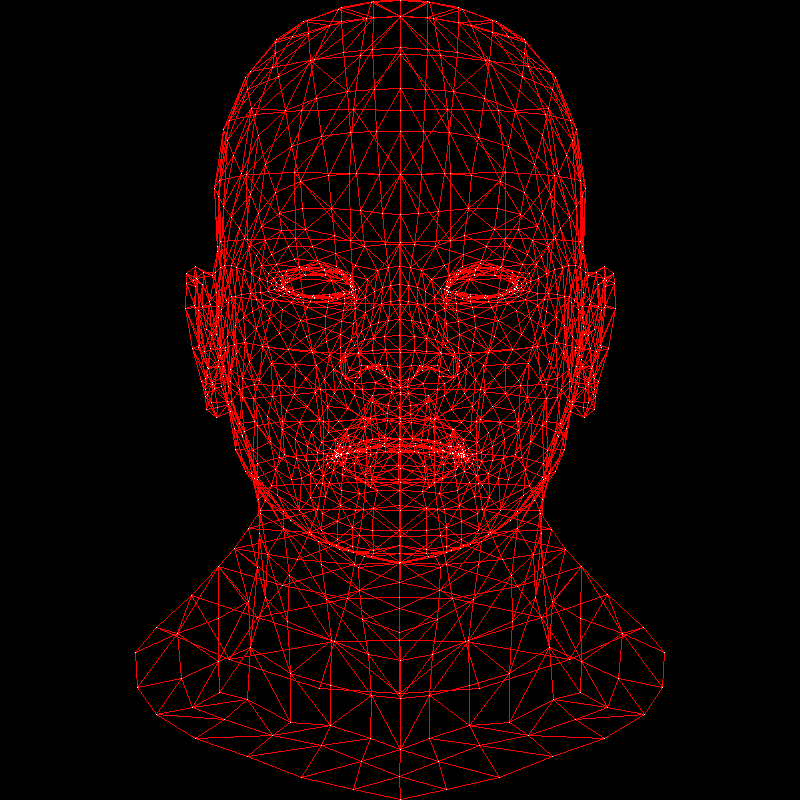
    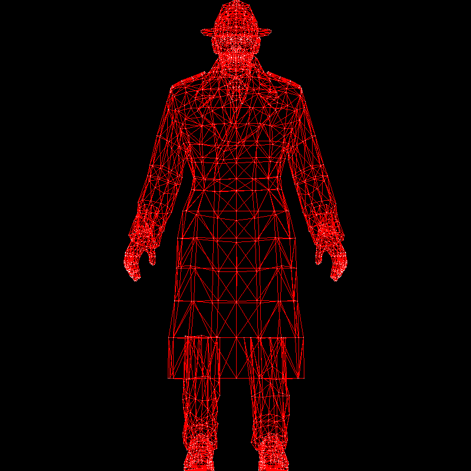
    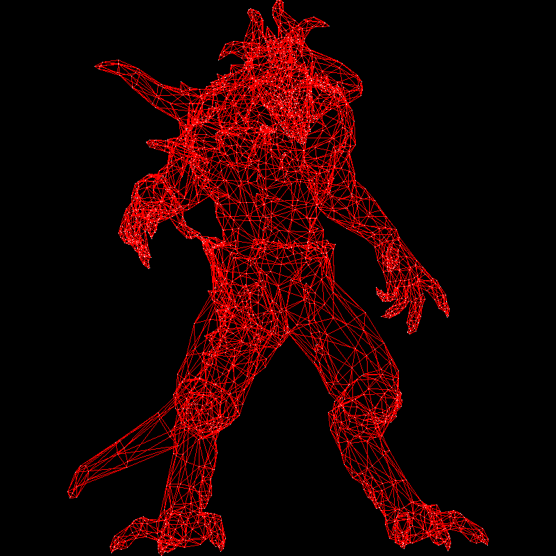
    

    

- [x] [三角形光栅化](https://haqr.eu/tinyrenderer/rasterization/)：遍历三角形所在包围盒内（只记录对角的两个点）的每个像素点，若像素点在三角形内（通过**重心坐标**判断）则为该像素上色。最后剔除符号面积过小甚至为负的三角形（它们不应该被看到）。

    

    
点击展开/折叠

    

    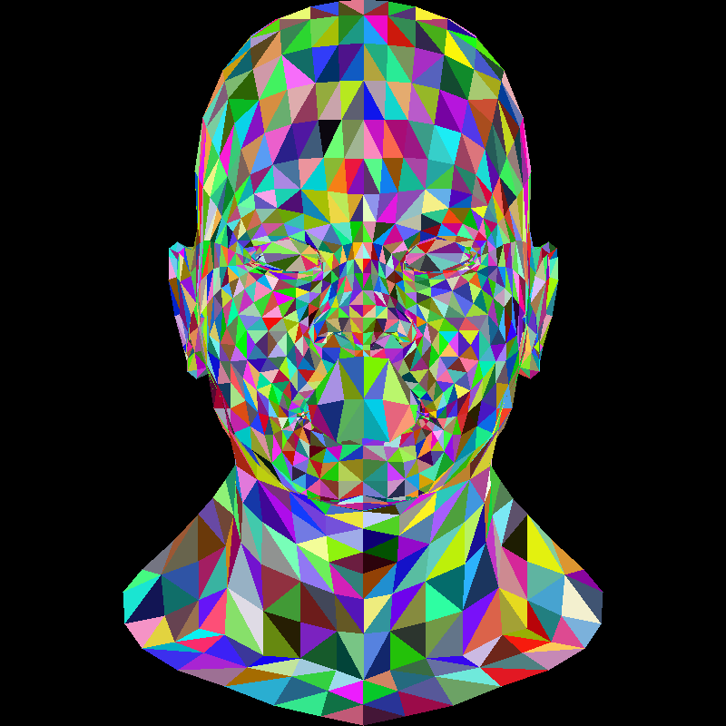
    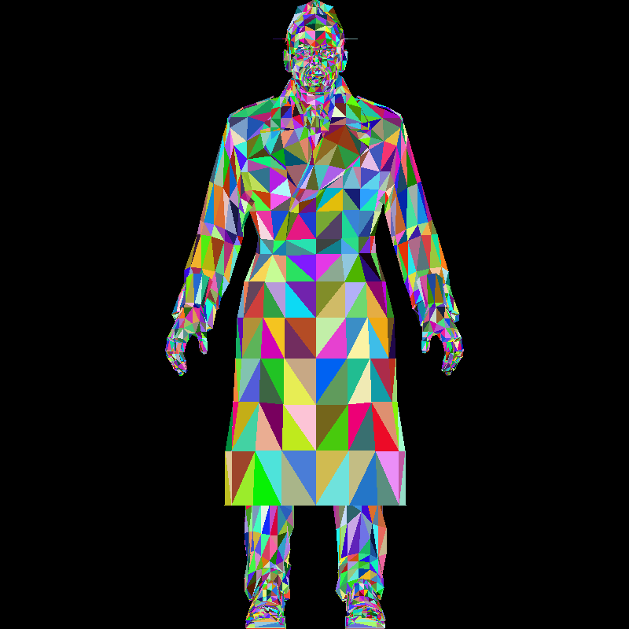
    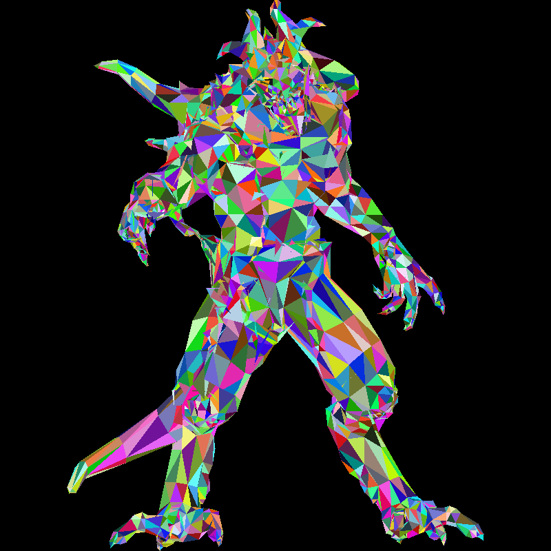
    

    

- [x] [重心坐标入门](https://haqr.eu/tinyrenderer/barycentric/)：利用三角形的符号面积（通过鞋带公式计算）计算三角形内一点的重心坐标，并根据重心坐标对**深度**、颜色等进行**插值**。

    

    
点击展开/折叠

    

    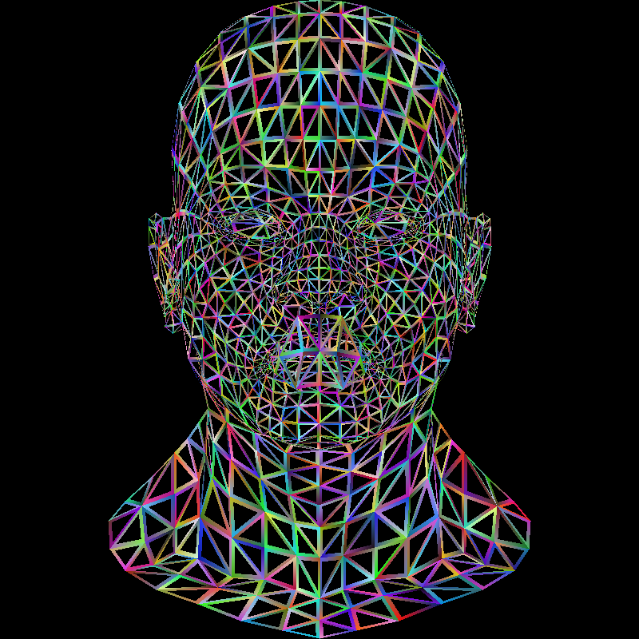
    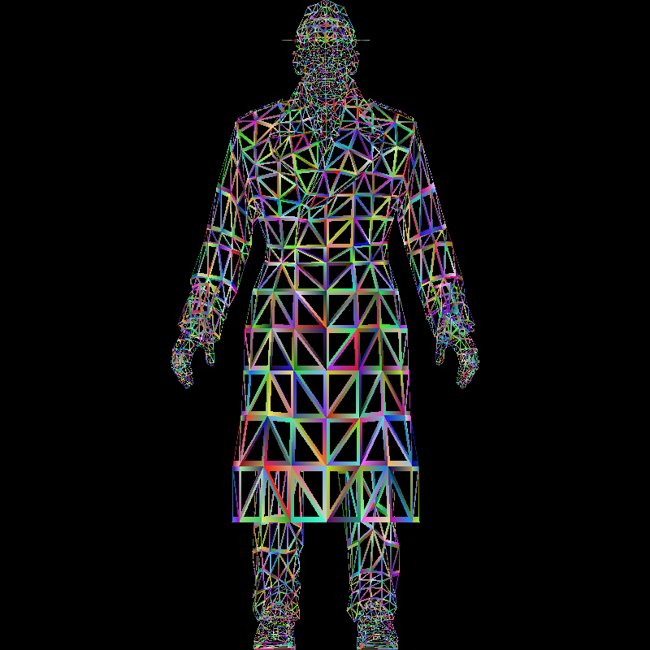
    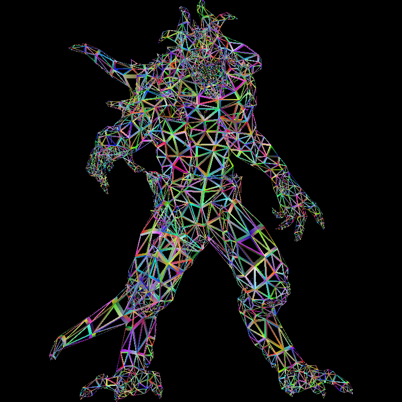
    

    

- [x] [隐藏表面去除](https://haqr.eu/tinyrenderer/z-buffer/)：
    - 先采用一般的画家算法，不仅计算开销大（场景一变就要对所有三角形重新排序），还有不少瑕疵（比如三个相互重叠的三角形无法确定绘制顺序）；
    - 改进做法是采用**逐像素的画家算法**：准备一个**深度缓冲区**(z-buffer)（通过前面提到的根据重心坐标进行深度插值），若当前像素在已绘制像素的外侧（深度缓冲区存的深度值更小），那就得更新深度缓冲区并设置最新的颜色；
    - 自行准备有关向量和矩阵计算的模板类，后面会频繁用到。

    

    
点击展开/折叠

    

    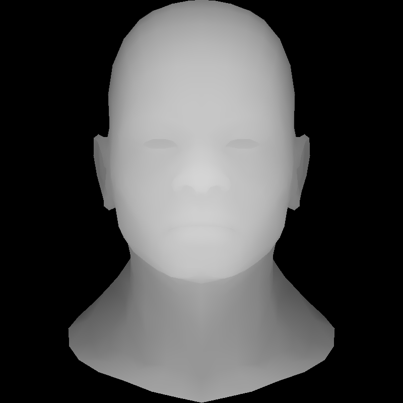
    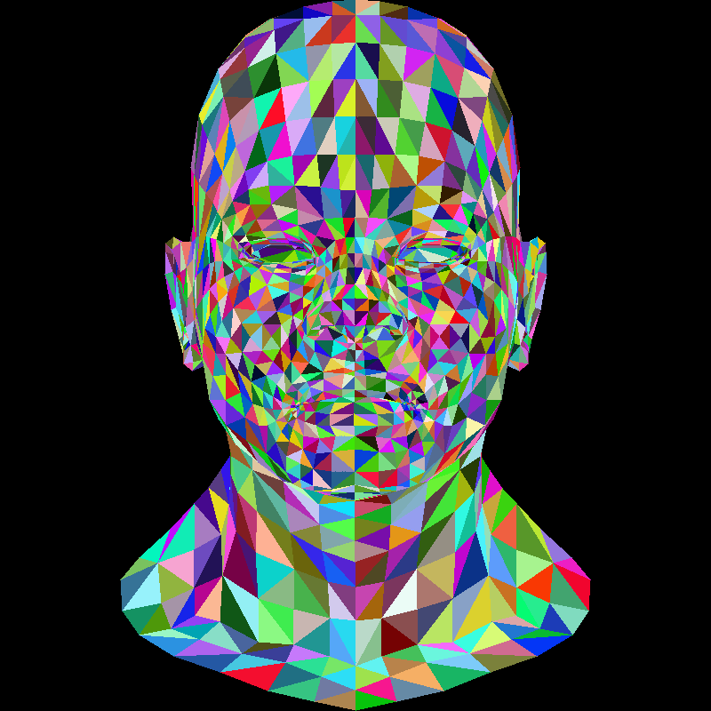
    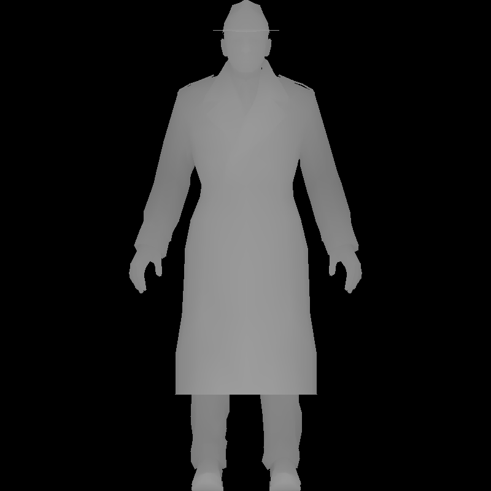
    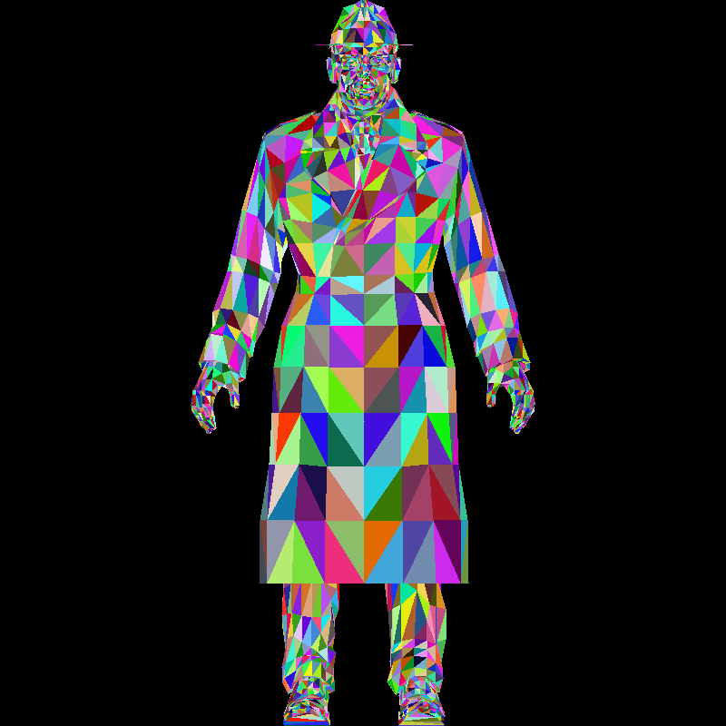
    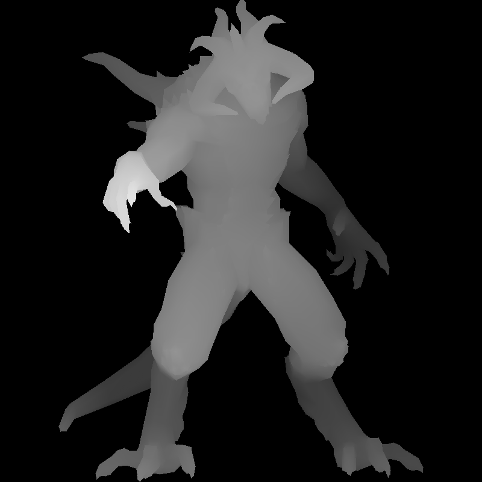
    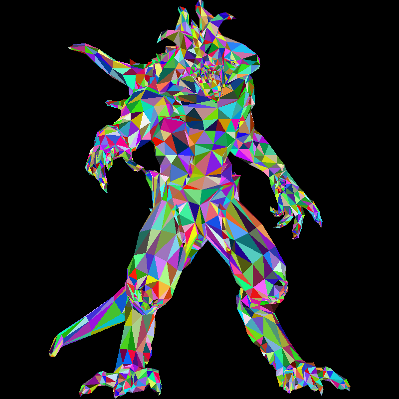
    

    

- [x] [处理相机的粗糙（但简单的）方法](https://haqr.eu/tinyrenderer/camera-naive/)：
    - 对每个顶点应用旋转矩阵，以达到旋转相机的效果（暂时无视深度 -> **正射投影**）；
    - 再应用**透视投影**（考虑深度），以达到“近大远小”的更真实的效果；
    - 由于旋转模型后可能会导致部分顶点深度超过范围，所以将 z-buffer 改为用浮点数组存储。
- [x] [更好的相机处理](https://haqr.eu/tinyrenderer/camera/)：
    - 变换链：对象坐标（.obj 文件里的坐标）-> 世界坐标（模型-视图变换）-> 相机坐标 -> 裁剪坐标（透视投影）-> 屏幕坐标（视口变换）；
    - 背景知识：线性变换（缩放、旋转、剪切...）、仿射变换（平移...）、齐次坐标；
    - **视口变换**：([-1, 1], [-1, 1], [-1, 1]) -> ([0, width), [0, height], [0, 255])；
    - **透视投影**：借助齐次坐标改写成矩阵-向量乘法形式；
    - **模型-视图变换**：根据相机位置（$\overrightarrow{\text{eye}}$）、相机朝向（从 $\overrightarrow{\text{eye}}$ 看向 $\overrightarrow{\text{center}}$）、相机朝上向量（$\overrightarrow{\text{up}}$）实现局部空间到世界空间的基变换。
- [x] [着色](https://haqr.eu/tinyrenderer/shading/)：
    - **渲染管线**：原始数据 -> **顶点着色器**(vertex shader)（处理顶点）-> **图元组装**(primitive assembly)（连接顶点形成图元（三角形））-> **光栅化器**(rasterizer)（将图元转换为一组片元）-> **片元着色器**(fragment shader)（处理片元）-> **输出合并**(output merging)（组合（3D 空间中）所有图元的片元，形成显示在屏幕上的 2D 彩色像素）；
    - 重构之前写的代码，并新增着色器类（但没有增加额外功能）；
    - **Phong 反射模型**：环境光(ambient)（常量）+ 漫反射(diffuse)（取决于入射光线与三角形表面的夹角）+ 镜面反射(specular)（取决于反射光线与相机朝向的夹角和预设的指数项）。
- [x] [更多数据（平滑着色 + 法线映射 + 纹理映射）](https://haqr.eu/tinyrenderer/textures/)：
    - 平滑着色：优化法线计算，从原来仅根据三角形两边叉积求得，到根据重心坐标和已知的顶点法向量信息计算更加精确的法向量；
    - **法线映射**：根据重心坐标（用于计算纹理坐标 uv）和已有的法线贴图（`_nm.tga` 文件）采样得到任意一点的法向量；
    - **纹理映射**：类似法线映射，但读取漫反射颜色（`_diffuse.tga` 文件（教程写错了））+ 高光纹理（`_spec.tga` 文件），为模型上色。需略微调整 Phong 反射模型的计算。
- [x] [**切空间法线映射**](https://haqr.eu/tinyrenderer/tangent/)：
    - 法线映射的问题：若艺术家复用 uv 坐标，则会导致同一像素对应不同法线，但一个颜色不能对应多个方向；
    - 切空间法线映射：对每个片元计算其所在三角形的**切空间**（基向量分别为切线、双切线和（插值计算得到的）法线），将在切空间法线贴图中采样得到的法线乘上由这三个向量构成的矩阵后得到准确的法线值；
    - 切空间法线贴图整体呈蓝紫色的原因：切空间的法线坐标总是为 (0, 0, 1)，对应 RGB 中的蓝色，颜色的些许变化来自局部基的移动而非纹素颜色本身。
- [x] [**阴影映射**](https://haqr.eu/tinyrenderer/shadow/)
    - Phong 反射模型的问题：只考虑局部信息，未考虑因物体阻挡光线产生的**阴影**等全局效果；
    - 两次渲染获得两个深度缓冲区：第一次从**光源**出发，第二次从**相机**出发；然后比较同一对象坐标在这两个深度缓冲区上的取值（具体的坐标变换见教程），若光源的 z-buffer 值更大（片元离相机近，离光源远），说明该片元处于阴影中（我的处理是仅保留环境光）。
- [x] [间接光照](https://haqr.eu/tinyrenderer/ssao/)
    - Phong 反射模型的另一个问题是环境光是常数，未考虑周围光线情况，缺乏真实感；
    - 解决方案有**全局光照**和**环境遮蔽**（AO），由于前者计算量大，因此在我们的渲染器中采用后者
    - AO 的暴力算法是假设光线从围绕物体的半球面的各个方向均匀打在物体表面上，不仅计算量大（需要保存多个 buffer），模拟效果也不怎么样
    - 一种效率更高的变体是 **SSAO**（屏幕空间环境遮蔽）：在后处理阶段中，在每个片元周围随机采样若干个点（具体怎么采样见仁见智，我的实现是沿 xy 平面某一半径范围内的圆采样，效果不如教程展示的那样）。若采样点深度更小，说明该片元被遮挡。统计能遮挡的采样点和总采样点数之间的比例，作为遮蔽系数。
- [ ] [卡通阴影](https://haqr.eu/tinyrenderer/toon/)

## 未来考虑的优化方向

- 光栅化中引入**反走样技术**，比如 **MSAA**；好处是让渲染图像的边缘看起来更平滑真实，但代价是增加了计算成本；